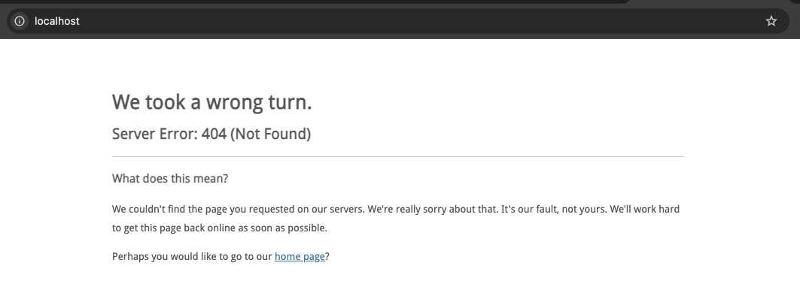

<p align="center">
<a href="https://laravel.com" target="_blank">

</a>
</p>
<p align="center">
Newsletter Subscription
</p>
<p align="center">
<a href="https://github.com/laravel/framework/actions"></a>
<a href="https://packagist.org/packages/laravel/framework"></a>
</p>

## About Laravel

This project was builded with Laravel 11. You can access the documentation of the framework at <a href="https://laravel.com/docs/11.x" target="_blank">Laravel Docs - v11.x</a>.

## Setup
To set up this project is simple, just run the commands below.

At the root dir of the project run `docker-compose up -d`, the command will create the nginx and app container on docker. Sure, your Docker must be running.
```sh
docker-compose up -d
```

Install project dependencies
> docker exec -it {container_name} sh -c "{command}", by default, use the command below.
```sh
docker exec -it laravel-newsletter-subscription-app-1 sh -c "composer install"
```

Run project boot set up. The command will run the migrations and run the CreateAdminSeeder class that will create a admin user.

Path: `database/seeders/CreateAdminUserSeeder.php`.

```sh
docker exec -it laravel-newsletter-subscription-app-1 sh -c "composer boot-project"
```

## How to access, run and test the application?
This project is API REST based so, you can't access any resource in your browser. You should use a shell curl command or tools like Postman, Insomnia and others tools.

If you try to access the application by your browser, you will see a page similar as:


To keep your set up fast and easy you should use `api.postman_collection.json` file. The file is localized at the root path of the project.

**Import the file in your postman. The collection have all you need to interact with the application.**

The project use SQLite as your database. You don't need to install anything else.

### Test coverage


## License

The Laravel framework is open-sourced software licensed under the [MIT license](https://opensource.org/licenses/MIT).
